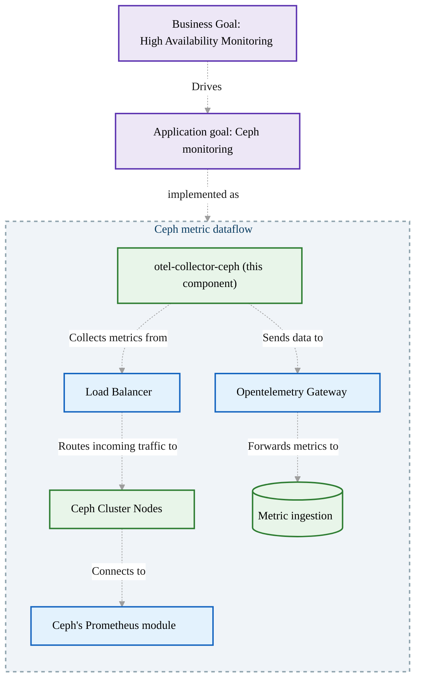

# Ceph OpenTelemetry Collector

## Overview

This README provides instructions for deploying and configuring the Ceph OpenTelemetry Collector. The collector is designed to gather metrics from a Ceph cluster and export them for monitoring and analysis. It connects to the Ceph endpoints through a domain name that points to a load balancer, ensuring high availability and scalability. A visualization has been made available below.


## Prerequisites

- A Kubernetes cluster with version 1.32 or later.
- OpenTelemetry Collector image available in your container registry.
- A domain name configured to point to a load balancer that routes traffic to the Ceph endpoints.
- Access to modify Kubernetes ConfigMaps and Secrets.

## Configuration

### ConfigMap

The OpenTelemetry Collector configuration is stored in a ConfigMap named `otel-collector-config-ceph`. This configuration defines the pipeline for collecting and exporting metrics. The target is configured in the secret which is loaded as an ENV in the deployment.

### Secrets

Create a Secret for storing sensitive information such as credentials to access the Ceph metrics endpoint.

```yaml
apiVersion: v1
kind: Secret
metadata:
  name: ceph-targets-secret
type: Opaque
stringData:
  CEPH_METRICS_TARGET: domainname  # Replace with your domain
```

## Deployment

The Ceph OpenTelemetry Collector is deployed as a Kubernetes Deployment. Ensure that the deployment is configured to use the `otel-collector-config-ceph` ConfigMap and `ceph-targets-secret` Secret.


## Usage

Once deployed, the OpenTelemetry Collector will start gathering metrics from the Ceph cluster via the specified domain name. Ensure that the load balancer is properly routing traffic to the Ceph endpoints.

Basic example:
```haproxy
frontend http
    bind *:80
    mode http
    acl allowed_network src 192.168.122.0/24 # Define your networks
    acl objectstore hdr(host) -i domainname # Replace with your domain
    acl metrics_path path -i /metrics

    use_backend be_ceph_metrics if allowed_network objectstore metrics_path

backend be_ceph_metrics
    mode http
    option httpchk

    http-check send meth GET uri /metrics ver HTTP/1.1 hdr Host localhost
    http-check expect status 200
    http-check expect string ceph_health_status # Check if the response body contains ceph_health_status, one of the prometheus metrics
    default-server inter 5s fall 2 rise 1 

    server ceph1 192.168.122.187:9283 check
    server ceph2 192.168.122.177:9283 check
    server ceph3 192.168.122.199:9283 check
```

## Troubleshooting

- Check the logs of the OpenTelemetry Collector for any errors or issues:
  ```bash
  kubectl logs -n observability <pod-name> | grep ceph
  ```
- Verify that the domain name is correctly pointing to the load balancer.
	```bash
	dig domainname +short
	```
- Verify that your loadbalancer has this IP:
	```bash
	dig domainname +short
	ip -c a | grep $(dig objectstore.tommahs.nl +short)
	```

## Future Enhancements

- Integrate with additional monitoring tools for enhanced observability.
- Enable tracing and logging capabilities.

